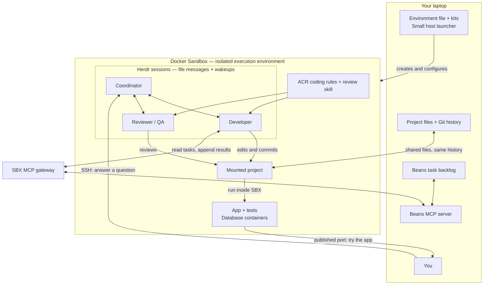

# Build a software factory with Docker Sandboxes

In this two-hour workshop, you'll build a small software factory: a team of coding
agents that takes a task, changes the code, reviews the result and asks for your
help when it needs a product decision. You'll start with one agent in Docker
Sandboxes and add the tools it needs to work as part of a team.

## What you will build

Your factory connects a task backlog on your laptop to a team of coding agents
inside Docker Sandboxes. The team works in your project, runs the services it
needs, and asks you when a decision needs a human.



You will build this one capability at a time. The roles can use Pi, Claude Code
or Codex, with the provider and model chosen for each role. The source and task
backlog stay on your laptop; agent sessions and application services run inside
the sandbox.

We'll use a sample web app for tracking service incidents, with an API and a
PostgreSQL database. It gives everyone the same starting point: you can ask the
agents to add a feature, try it in your browser and check their work against the
task. Along the way, they'll run commands and database containers inside SBX,
review changes and write results back to your backlog. Once the factory is working,
you'll try it with a project of your own.


You will leave with sandbox environment files, reusable kits, coding guidance and a team
configuration you can adapt to your own project. The same setup is also a place to
try new coding assistants and models: install their tools inside SBX, give them the
same project and guidance, and compare how they work before choosing your team.

## What you will learn

Each chapter adds something the factory needs:

| Step | What you will learn |
|---|---|
| Run one agent | Use SBX interactively, explore file isolation and shared files, run containers, and open the app through a published port. |
| Repeat the setup | Describe an environment with sbxenv and connect it to a demo task in our task tracker, Beans, with a small host script. |
| Share tools and guidance | Build a simple kit, then use the ACR kit to install a coding policy and review skill. |
| Try assistants and models | Install Pi inside SBX, compare assistants on the same project, and choose the assistant, provider and model for each role. |
| Form a team | Use Herdr to manage sessions and pass assignments between a coordinator, developer and reviewer. |
| Connect to host tools | Give the team scoped access to the task tracker through the MCP gateway and explore network controls. |
| Bring in a human | Join through SSH, answer a product question and let the team continue. |
| Use your own project | Supply another repository and task, let agents discover its setup, and review changes in your working copy. |

We’ll also explore AI governance features and bleeding-edge additions to Docker
Sandboxes.

## About the tool choices

Docker Sandboxes provides the environment, kits, network controls and MCP gateway.
The author chose Beans, ACR, Herdr, Pi, Claude Code and Codex for this example,
along with the coding policy and team workflow. These choices are personal;
Docker does not endorse or recommend them through this workshop. You can use the
same Docker capabilities with your own tools and conventions.

[Docker Agent](https://docs.docker.com/ai/docker-agent/) is another option for
building agent teams, with roles, models, tools and delegation defined in YAML.
This workshop uses Herdr to coordinate coding assistants; the SBX environment and
access-control concepts apply whichever team framework you choose.

## Get started

Bring a **Mac with Apple silicon** or a **Windows x64 machine with Git Bash**,
a browser and model access. Those are the two attendee host platforms tested and
supported during the workshop. Experienced Linux users are welcome to try the
exercises on a best-effort, self-supported basis, but the instructor may not be
able to troubleshoot Linux-specific setup differences during the session.
[Chapter 0](chapters/00-setup/README.md#1-install-the-host-prerequisites)
walks you through installation, accounts and downloading the sample application.
The first exercise uses Claude Code with your Claude account. Later, Anthropic API
access lets you try Pi yourself; with subscription access alone, follow that model
conversation with a partner or presenter and run your own team using Claude Code
for all three roles. Everyone configures the roles and their models.
[Chapter 0](chapters/00-setup/README.md#2-have-an-agent-account-ready)
explains the account requirements. Docker containers run inside SBX, so you do not
need Docker Desktop or a host Docker engine.

Installation and model authentication are part of the workshop. The repository
and sample materials are publicly downloadable. After cloning this repository,
run the materials helper from its root:

```bash
./scripts/get-materials.sh
```

It downloads the pinned sample-app bundle from the workshop's
[materials-v0.1.0 GitHub release](https://github.com/shelajev/wad-sbx-workshop/releases/tag/materials-v0.1.0),
verifies its checksum, keeps the checkpoint repository in `.local/app/`, and
creates the editable application in `sample-app/`. It also downloads the Beans
MCP adapter used later in the workshop into `dist/`. Chapter 0 explains these
directories and how to recover or catch up without losing existing work.

**[Start with Chapter 0: Setup →](chapters/00-setup/README.md)**

Or browse the [chapter guide](chapters/README.md) to see the whole journey.

## How to use this repository

Use two terminal tabs, both initially opened at this repository root:

- **HOST** stays on your laptop for sandbox creation, network policy and task tracking.
- **SANDBOX** is where you open the assistant or shell inside SBX. Keep that session open while the agents work.

We run one workshop sandbox at a time. Chapters 01–06 mount the same `sample-app/`
working copy, including its Git history. Chapter 7 applies the factory to another
project you choose. Edits appear on your host immediately.
Containers and application processes run inside SBX. A chapter ends by removing
its sandbox; the mounted source remains for the next chapter.

From chapter 2, you will build one configuration in `factory/`, adding tools and
capabilities to the same `factory/sbxenv.yaml` as you go.

Follow each chapter from the top. Each step tells you which files to create or
edit, what to run and what to look for afterward.

| Directory | What is inside |
|---|---|
| `chapters/00-setup` through `08-presenter` | Walkthroughs, reference configurations and presenter demonstrations |
| `chapters/examples` and `chapters/kits` | Small examples and reusable kits |
| `chapters/support` | Launcher, sandbox helpers and agent role instructions |
| `scripts` | Material downloads and host setup helpers |
| `backlog/seed` | Tasks for the agents to work on |

## License

Workshop source is licensed under [Apache 2.0](LICENSE). The [Beans MCP adapter](mcp/beans/LICENSE)
and third-party components retain their own licenses and notices.
